# scratch-monkey: How It Works

## Introduction

scratch-monkey is a dev container manager built on rootless Podman, designed
for Fedora Atomic / ostree systems (Silverblue, Kinoite, Bazzite, etc.) where
the host OS is immutable.

Instead of layering packages onto the host with `rpm-ostree`, scratch-monkey
lets you spin up lightweight, disposable dev environments as Podman containers.
Each environment — called an **instance** — gets its own home directory,
Dockerfile, and TOML config file. You can enter and exit instances in
seconds, customize them freely, and throw them away without affecting your host.

Two base image types are available:

- **Scratch** instances bind-mount your host `/usr` and `/etc` read-only into
  an empty container — near-zero build time, instant startup, access to all
  host-installed tools.
- **Fedora** instances use a full `fedora:latest` image — self-contained,
  with their own `dnf`, isolated from the host.

Additional features include persistent overlay containers, shared volumes
for inter-instance communication, GPU/device passthrough, command export
to make container tools available on the host PATH, and an optional Qt GUI.

### Coding agent sandbox

A primary use case for scratch-monkey is providing isolated dev environments
for AI coding agents (Claude Code, Aider, Copilot Workspace, etc.). Running
an agent inside a scratch-monkey instance means it can install packages, modify
system files, and experiment freely without any risk to your host OS.

This is especially useful with flags like `--dangerously-skip-permissions` that
give an agent full autonomy — inside a scratch-monkey container, "dangerous"
operations like `rm -rf /`, `dnf remove --all`, or writing to `/etc` are
fully contained. The worst case is a `scratch-monkey reset` or
`scratch-monkey delete` to start fresh.

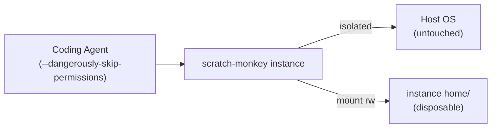

> **Not a security sandbox.** scratch-monkey is designed for *developer
> convenience*, not for adversarial containment. It uses rootless Podman with
> `--network=host`, `--security-opt label=disable`, and bind-mounted host
> paths. These are reasonable defaults for dev work but are **not appropriate
> for malware analysis, reverse engineering untrusted binaries, or any
> security research where containment is critical**. The project has not been
> designed or audited for that purpose, and some design choices (host
> networking, SELinux disabled, host filesystem mounts) actively work against
> it. For that kind of work, use purpose-built isolation tools (VMs, gVisor,
> dedicated sandboxing frameworks).

---

## Table of Contents

- [Coding Agent Sandbox](#coding-agent-sandbox)
- [Installation](#installation)
- [Core Concepts](#core-concepts)
- [Base Image Architecture](#base-image-architecture)
- [Instance Lifecycle](#instance-lifecycle)
- [Container Runtime](#container-runtime)
- [Overlay Mode](#overlay-mode)
- [Shared Volumes](#shared-volumes)
- [Command Export](#command-export)
- [GPU and Device Passthrough](#gpu-and-device-passthrough)
- [Configuration Reference](#configuration-reference)
- [GUI](#gui)
- [CLI Reference](#cli-reference)

---

## Installation

### Prerequisites

- **Podman** (rootless) — comes pre-installed on Fedora Atomic desktops
- **Python 3.11+**
- **uv** (Python package manager) — the install script will offer to install
  it if missing

### Install from source

Clone the repository and run the install script:

```bash
git clone https://github.com/djoyce/scratch-monkey.git
cd scratch-monkey
./install.sh
```

The install script:

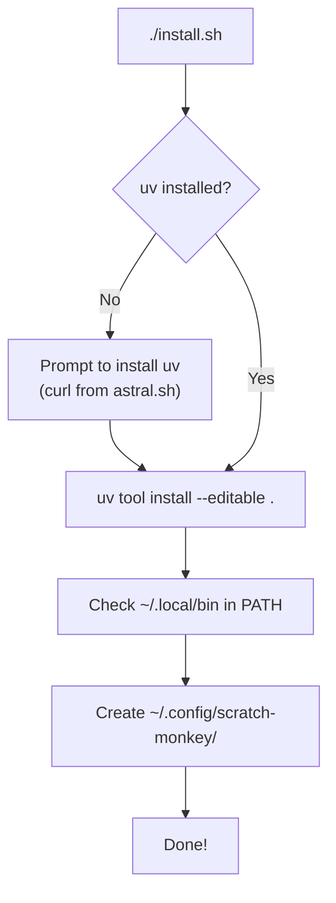

1. Checks for `uv` and offers to install it if missing
2. Runs `uv tool install --editable .` to install the CLI
3. Warns if `~/.local/bin` is not in your `PATH`
4. Creates the config directory at `~/.config/scratch-monkey/`

### Install with GUI

Pass `--gui` to include the Qt6/Enaml GUI dependencies:

```bash
./install.sh --gui
```

Or manually:

```bash
uv tool install --editable ".[gui]"
```

### Manual install (without install.sh)

If you already have `uv`:

```bash
git clone https://github.com/djoyce/scratch-monkey.git
cd scratch-monkey

# CLI only
uv tool install --editable .

# With GUI
uv tool install --editable ".[gui]"
```

### Verify installation

```bash
scratch-monkey --help
```

### Quick start

```bash
# Create a scratch-based instance
scratch-monkey create myproject

# Or a fedora-based instance with your shell configs
scratch-monkey create myproject --fedora --skel

# Enter the instance
scratch-monkey enter myproject
```

---

## Core Concepts

scratch-monkey manages **instances** — named dev environments backed by Podman
containers. Each instance has its own home directory, Dockerfile, config, and
optional persistent overlay.

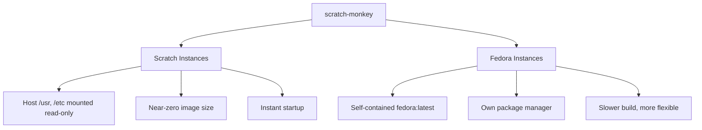

There are two fundamentally different base image types:

| | Scratch | Fedora |
|--|---------|--------|
| Base | Empty (`FROM scratch`) | `FROM fedora:latest` |
| Host mounts | `/usr`, `/etc`, `/var/usrlocal`, `/var/opt` (ro) | None |
| Package manager | Host's (via bind mount) | Container's own `dnf` |
| Image size | ~KB (just symlinks) | ~500MB+ |
| `RUN` in Dockerfile | No (no shell) | Yes |
| User setup in overlay | Skipped (host `/etc` has it) | `useradd` + sudoers created |
| Best for | Quick envs using host tools | Isolated envs needing own packages |

---

## Base Image Architecture

### Scratch base image

The scratch image is built with a multi-stage Dockerfile. A Fedora builder
creates a minimal rootfs with symlinks that match Fedora's ostree layout,
then copies it into an empty `FROM scratch` image.

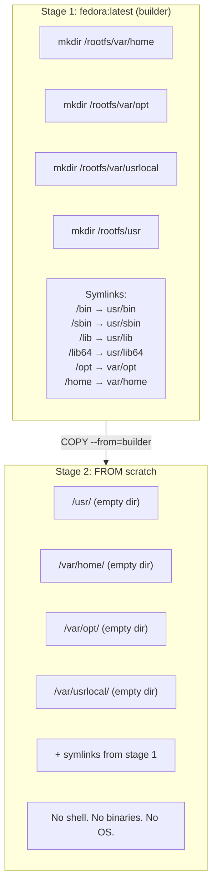

At runtime, the host filesystem fills these empty directories:

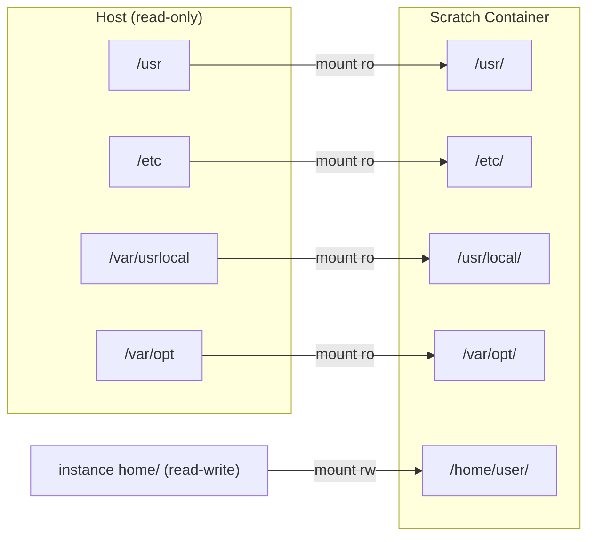

### Fedora base image

Just `FROM fedora:latest`. A complete OS. Only the instance home directory
is mounted from the host.

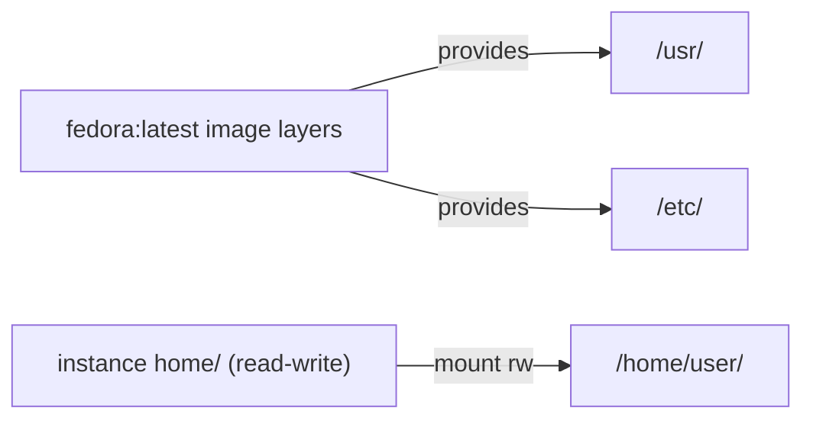

### Instance image layering

When you customize an instance's Dockerfile and run `build-instance`,
a new image layer is added on top of the base:

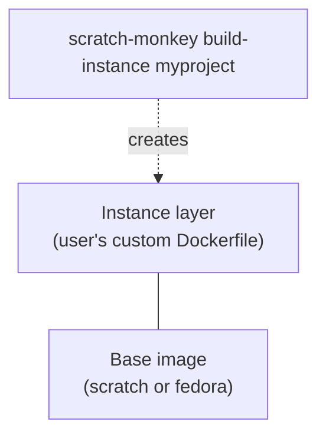

For scratch instances, the Dockerfile can't use `RUN` (no shell).
Use multi-stage builds to compile tools and `COPY` them in:

```dockerfile
FROM golang:latest AS builder
RUN go install github.com/some/tool@latest

FROM scratch_dev
COPY --from=builder /go/bin/tool /usr/local/bin/tool
```

For fedora instances, everything works normally:

```dockerfile
FROM scratch_dev_fedora
RUN dnf install -y git vim neovim
```

---

## Instance Lifecycle

### Directory structure

Each instance lives at `~/scratch-monkey/<name>/`:

```
~/scratch-monkey/
  myproject/
    home/           # Container home dir (mounted rw at /home/$USER)
    Dockerfile      # Extends base image, customizable
    scratch.toml    # Instance configuration
    .env            # Environment secrets (KEY=VALUE, one per line)
  another/
    home/
    Dockerfile
    scratch.toml
    .env
  .shared/          # Hidden dir for shared volumes
    comms/
    data/
```

### Create

```
scratch-monkey create myproject [--fedora] [--skel]
```

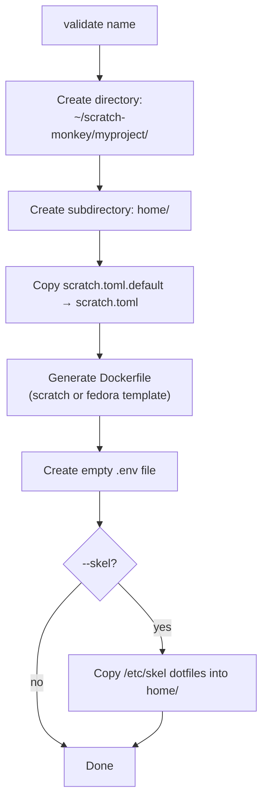

### Clone

```
scratch-monkey clone myproject myproject-copy
```

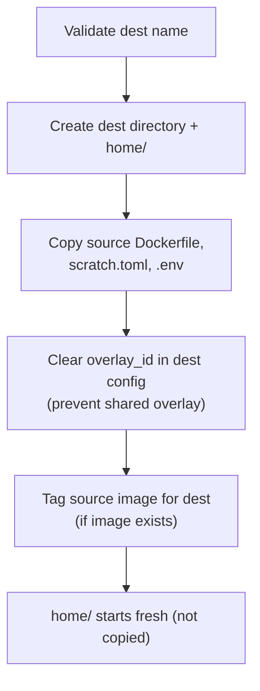

### Delete

```
scratch-monkey delete myproject [--yes]
```

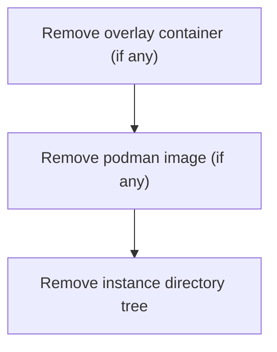

### Rename

```
scratch-monkey rename old-name new-name
```

Renames the directory and re-tags the image. The overlay_id (if set)
is decoupled from the instance name, so overlays survive renames.

---

## Container Runtime

When you run `scratch-monkey enter myproject`, this is what happens:

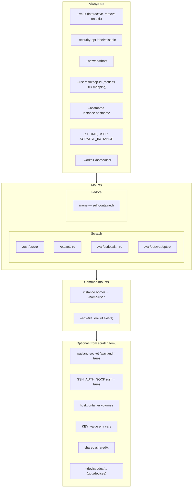

---

## Overlay Mode

Overlay mode creates a persistent daemon container that survives between
sessions. Changes made inside the container (package installs, config edits
outside home/) persist without rebuilding the image.

### Without overlay (default)

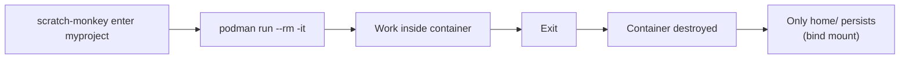

Every `enter` starts fresh from the image. Anything written outside
the home directory is lost.

### With overlay

```toml
# scratch.toml
overlay = true
```

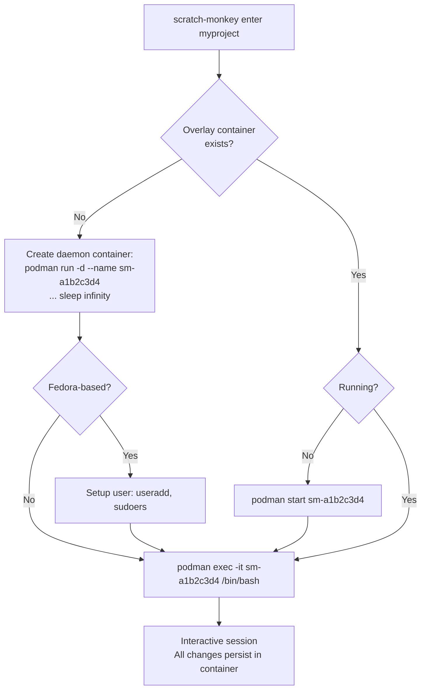

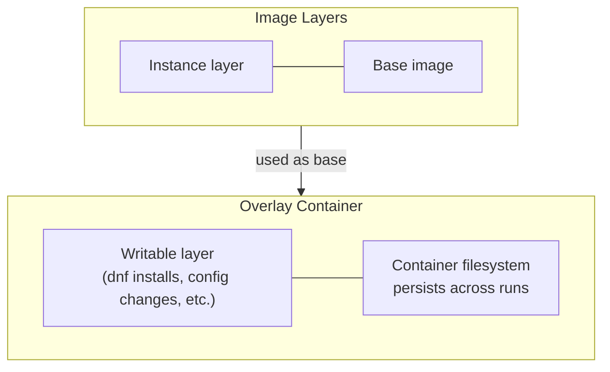

### Overlay user setup (fedora only)

When a fedora overlay container starts for the first time, scratch-monkey
sets up the user inside it:

1. `dnf install -y sudo` (if not present)
2. `useradd -u <host_uid> -M -s /bin/bash <username>`
3. `echo "<user> ALL=(ALL) NOPASSWD:ALL" > /etc/sudoers.d/<user>`

This is skipped for scratch instances because host `/etc` is bind-mounted
read-only — the host user and sudo config are already visible.

### Reset

```
scratch-monkey reset myproject
```

Removes the overlay container, discarding all changes outside home/.
Next `enter` creates a fresh overlay from the image.

### Overlay ID

Each overlay container gets a unique ID (e.g., `sm-a1b2c3d4`) stored in
`scratch.toml` as `overlay_id`. This decouples the container name from the
instance name, so renames don't break overlays. Cloning clears the
overlay_id to prevent two instances sharing one container.

---

## Shared Volumes

Shared volumes let multiple instances access the same host directory.
Useful for IPC via files, sockets, FIFOs, or shared databases.

```
~/scratch-monkey/.shared/
  comms/          <-- shared volume "comms"
  data/           <-- shared volume "data"
```

```
scratch-monkey share create comms
scratch-monkey share add comms agent1
scratch-monkey share add comms agent2
```

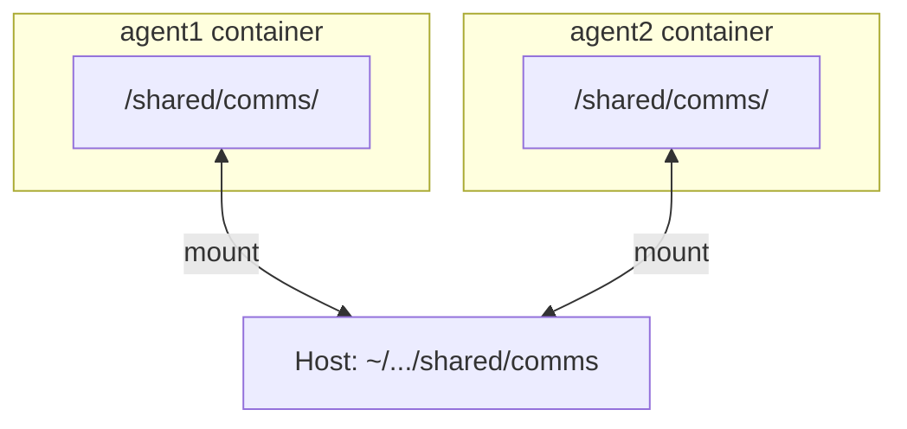

Mode control in `scratch.toml`:

```toml
shared = ["comms", "data:ro"]   # comms is rw, data is read-only
```

Deleting a shared volume automatically removes it from all instance configs.

---

## Command Export

Export makes a command from inside an instance available on your host PATH:

```
scratch-monkey export myproject /usr/bin/rg
```

This creates `~/.local/bin/rg` — a wrapper script with three execution paths:

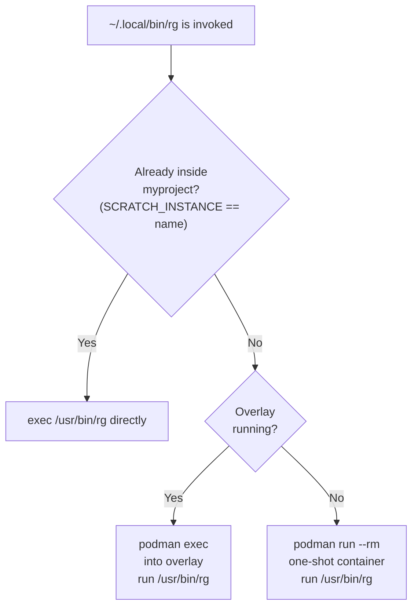

Remove with `scratch-monkey unexport rg`.

---

## GPU and Device Passthrough

### GPU auto-detection

When `gpu = true` in `scratch.toml`, scratch-monkey scans for:

| Device | Purpose |
|--------|---------|
| `/dev/dri` | DRM (Intel, AMD, generic GPU) |
| `/dev/kfd` | AMD ROCm compute |
| `/dev/nvidia*` | NVIDIA GPUs |

Each detected device is passed with `--device`.

### Extra devices

For other hardware (webcams, USB devices, etc.):

```toml
devices = ["/dev/video0", "/dev/bus/usb"]
```

---

## Configuration Reference

All fields in `scratch.toml` are optional.

| Field | Type | Default | Description |
|-------|------|---------|-------------|
| `cmd` | string | `/bin/bash` | Shell command to run on entry |
| `wayland` | bool | `false` | Forward Wayland display socket |
| `ssh` | bool | `false` | Forward SSH agent socket |
| `home` | string | `""` | Override home dir (empty = instance `home/`) |
| `overlay` | bool | `false` | Enable persistent overlay container |
| `gpu` | bool | `false` | Auto-detect and pass through GPU devices |
| `volumes` | list | `[]` | Extra bind mounts (`host:container[:mode]`) |
| `env` | list | `[]` | Extra environment variables (`KEY=value`) |
| `shared` | list | `[]` | Shared volume names (`name` or `name:ro`) |
| `devices` | list | `[]` | Extra device paths to pass through |
| `overlay_id` | string | `""` | Auto-generated overlay container ID |

### Environment inside the container

These are always set:

| Variable | Value |
|----------|-------|
| `HOME` | `/home/$USER` (or `/root` with `--root`) |
| `USER` | Host username |
| `SCRATCH_INSTANCE` | Instance name |

Conditionally set:

| Variable | When |
|----------|------|
| `WAYLAND_DISPLAY` | `wayland = true` |
| `XDG_RUNTIME_DIR` | `wayland = true` |
| `SSH_AUTH_SOCK` | `ssh = true` |

Plus any variables from `.env` and the `env` config list.

---

## GUI

Install with GUI dependencies:

```bash
uv tool install --editable ".[gui]"
scratch-monkey gui
```

The GUI provides a graphical interface to all instance management features.

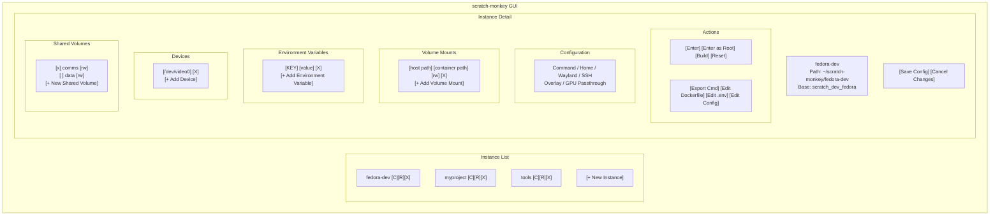

### Key features

- **Instance list**: Status indicators (running/built/no image), base type (F for fedora),
  clone/rename/delete buttons per instance
- **Config editing**: All scratch.toml fields editable in-place, dirty tracking
  with save/revert, orange highlight on unsaved changes
- **Actions**: Enter, build, reset overlay, export commands, edit files in terminal
- **Edit Config**: Opens scratch.toml in `$VISUAL`/`$EDITOR`, auto-reloads on close
- **Create dialog**: Name, fedora toggle, skel toggle, full config editor
- **Shared volumes**: Toggle per-instance, create new volumes inline

---

## CLI Reference

### Global options

```
scratch-monkey [--instances-dir DIR] [--base-image IMAGE] COMMAND
```

| Option | Default | Description |
|--------|---------|-------------|
| `--instances-dir` | `~/scratch-monkey` | Where instances are stored |
| `--base-image` | `scratch_dev` | Default base image for new instances |

### Commands

| Command | Description |
|---------|-------------|
| `create <name> [--fedora] [--skel]` | Create a new instance |
| `clone <source> <dest>` | Clone instance (fresh home) |
| `delete <name> [--yes]` | Delete instance, image, and overlay |
| `rename <old> <new>` | Rename an instance |
| `list` | List all instances with status |
| `skel <name>` | Copy /etc/skel dotfiles into home |
| `edit <name> [--file config\|dockerfile\|env]` | Edit instance files |
| `build [--fedora] [--yes]` | Build a base image |
| `build-instance <name>` | Build instance Dockerfile (auto-builds base) |
| `enter <name> [--root]` | Interactive shell |
| `run <name> [--root] [--wayland] [--ssh] [--cmd CMD]` | Run with overrides |
| `reset <name> [--yes]` | Remove overlay container |
| `export <name> <cmd> [bin]` | Export command to ~/.local/bin |
| `unexport <bin>` | Remove exported command |
| `share create <name>` | Create a shared volume |
| `share delete <name> [--yes]` | Delete shared volume (cleans all configs) |
| `share add <vol> <instance>` | Add volume to instance |
| `share remove <vol> <instance>` | Remove volume from instance |
| `share list` | List volumes and which instances use them |
| `gui` | Launch graphical interface |
